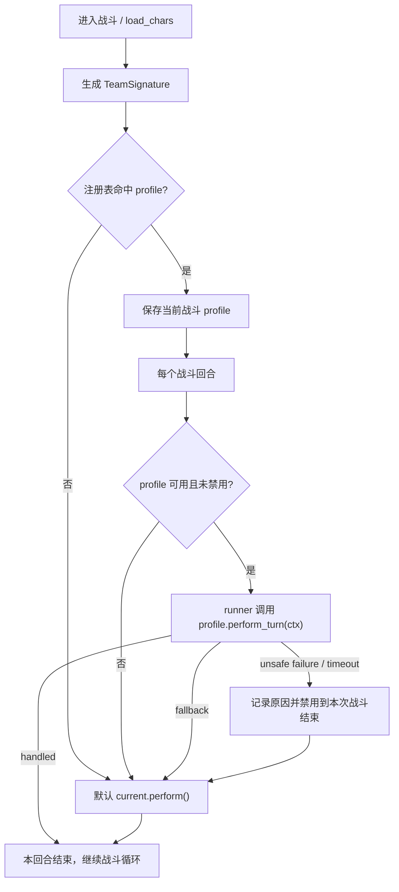

# 队伍级战斗轴 Profile Design

## 0. 术语约定

| 术语 | 定义 | 防冲突结论 |
|---|---|---|
| 队伍 profile | 针对一组角色组合注册的代码级战斗编排对象。 | 代码中已有 `FarmEchoTask` 的 boss profile 和少量局部变量 `profile`，本 feature 使用 `TeamRotationProfile` 全称，避免和刷声骸 boss profile 混用。 |
| 队伍签名 | 用队伍中识别到的标准角色名组成的匹配 key。 | 现有 `in_team` 表示“处在队伍界面/队伍态”，不拿来命名 profile 匹配结构；匹配结构统一叫 `TeamSignature`。 |
| rotation runner | 在战斗循环里尝试执行队伍 profile 的薄编排层。 | 现有代码没有“rotation”概念，只有图像旋转矩阵变量；新增命名限定在 `team rotation` 上。 |
| fallback | 队伍 profile 未命中或不能安全执行时，回到当前 `BaseChar.perform()` / 通用换人规则。 | fallback 是流程约束，不是异常吞掉；离开战斗、角色死亡这类现有异常仍按原语义传播。 |

## 1. 决策与约束

### 需求摘要

做什么：新增一个开发者配置的队伍级 profile 层。自动战斗识别出队伍角色后，如果命中特定队伍 profile，就允许 profile 接管必要的动作和换人顺序；未命中或执行失败时，继续使用默认自动战斗。本次同时内置爱弥斯 / 达妮娅 / 千咲队伍的 5R2 近似轴。

为谁：维护战斗逻辑和新增队伍支持的开发者。

成功标准：

- 没有注册 profile 的队伍，自动战斗行为保持现状。
- 注册了 profile 的队伍，战斗循环会先尝试 profile，并能观测到 profile 接管了当前回合。
- 爱弥斯 / 达妮娅 / 千咲队伍命中内置 profile 后，按视频总轴图的“启动轴 → 循环轴”顺序驱动：千咲起手、达妮娅衔接、千咲补段、爱弥斯收轴，随后进入循环。
- profile 主动放弃、动作不可用、执行异常或超时时，系统回退默认 `current_char.perform()`，不让战斗循环卡死。
- profile 匹配和 runner 行为有单元测试覆盖，不依赖真实游戏画面才能验证。

明确不做：

- 不做普通用户可编辑的 YAML / JSON 配置。
- 不做 GUI 配置入口。
- 不做无限自由脚本语言。
- 不做逐帧级精确还原；视频轴中的普攻段数、强化 E、R2、声骸等只映射到现有角色动作 API 能稳定表达的近似自动化序列。
- 不重写现有角色类的基础动作逻辑，也不替换通用换人策略。

### 复杂度档位

走项目内部工具默认档位，偏离项如下：

- 健壮性 = L3 严防（偏离默认 L2 的原因：战斗循环一旦卡住会直接影响用户操作，profile 失败必须有明确 fallback）。
- 结构 = modules（偏离默认 functions 的原因：现有 `BaseCombatTask.py` 和 `BaseChar.py` 已偏大，队伍 profile 需要独立模块承载，避免继续堆进战斗基类）。
- 可测试性 = tested（偏离默认 testable 的原因：profile 匹配、接管、fallback 都能用纯单元测试验证，不能只留成手工测试）。

### 关键决策

- 选“队伍 profile 层”，不选“把特殊逻辑继续写进角色类”：这样队伍级规则集中在一个注册表里，后续查某套队伍的轴不需要跨多个角色文件。
- profile 匹配 key 使用角色对象的标准类名 `BaseChar.name`，不使用模板 label。模板 label 可能存在男女主、别名、旧图标等多个入口，类名已经是 `CharFactory` 归一化后的运行时身份。
- 队伍签名第一版按角色集合匹配，不按站位匹配。profile 执行时仍可读取每个角色的实际 `index` 来切人；同一角色重复上阵不是当前游戏队伍模型要处理的问题。
- runner 是 `BaseCombatTask` 的可选策略对象，而不是 `AutoCombatTask` 独有能力。原因是 `DomainTask`、`FarmEchoTask`、`TacetTask` 等也继承 `BaseCombatTask` 并调用 `combat_once()`，队伍 profile 应该接在公共战斗循环能力上。
- fallback 粒度分两层：profile 主动返回“本回合不处理”时只回退本回合；profile 发生执行错误、超时或违反安全条件时禁用到本次战斗结束，避免同一个坏 profile 每帧重复触发。

### 前置依赖

无。结构健康度评估建议新增独立模块并只在战斗基类放薄挂钩，不需要先做行为不变的微重构。

## 2. 名词与编排

### 2.1 名词层

#### 现状

- `BaseCombatTask`：战斗任务基类，维护 `self.chars`、`load_chars()`、`combat_once()`、`switch_next_char()` 等公共战斗能力。当前没有队伍级策略对象。
- `AutoCombatTask.run()`：触发式自动战斗循环，进入战斗后反复执行 `self.get_current_char().perform()`。
- `BaseCombatTask.combat_once()`：一次性战斗循环，`load_chars()` 后反复执行当前角色 `perform()`。
- `CharFactory.get_char_by_pos()`：根据头像模板识别角色，返回具体 `BaseChar` 子类实例；角色 label 在这里被归一化为类实例。
- `BaseChar`：角色基础动作入口，`perform()` 调用角色自己的 `do_perform()`，角色内部再通过 `switch_next_char()` 回到通用换人规则。

#### 变化

- 新增 `TeamSignature`：由当前队伍中非空角色的 `char.name` 组成的不可变匹配 key。示例：`("Carlotta", "Roccia", "ShoreKeeper")`。
- 新增 `TeamRotationProfile`：开发者实现的队伍级 profile，声明 `signature`，并提供 `perform_turn(context)`。
- 新增 `TeamRotationContext`：profile 执行时的安全上下文，暴露当前 task、当前角色、按角色名查找队友、执行默认当前角色动作、按角色名切换目标等能力。
- 新增 `TeamRotationResult`：runner 的可观察结果，表达“已处理 / 本回合让默认逻辑处理 / 禁用 profile 并回退”的结果。
- 新增 `TeamRotationRegistry`：代码级注册表，保存 profile 列表，并根据当前 `chars` 选择匹配项。
- `BaseCombatTask` 增加当前战斗的 profile 状态：匹配到的 profile、是否已因失败禁用、最近 fallback 原因。
- 新增 `AemeathDeniaChisaProfile`：根据 B 站视频 `BV1aDGe6JEwT` 的总轴图内置的爱弥斯 / 达妮娅 / 千咲 profile，区分启动轴和循环轴。

接口示例：

```python
# 来源：新增 src/combat/rotation/*
signature = TeamSignature.from_chars(task.chars)
profile = registry.match(signature)

context = TeamRotationContext(task=task, profile=profile)
result = profile.perform_turn(context)

if result.handled:
    return True
return context.default_perform()
```

```python
# 来源：新增 src/combat/rotation/*
class ExampleProfile(TeamRotationProfile):
    signature = TeamSignature.of("Carlotta", "Roccia", "ShoreKeeper")

    def perform_turn(self, ctx):
        current = ctx.current_char
        if current.name == "Roccia":
            ctx.perform_default()
            return TeamRotationResult.handled()
        return TeamRotationResult.fallback("profile does not handle this current character")
```

```python
# 来源：新增 src/combat/rotation/profiles.py
class AemeathDeniaChisaProfile(TeamRotationProfile):
    signature = TeamSignature.of("Aemeath", "Denia", "Chisa")
    startup_order = ("Chisa", "Denia", "Chisa", "Denia", "Chisa", "Aemeath")
    cycle_order = ("Chisa", "Denia", "Chisa", "Aemeath")
```

### 2.2 编排层



#### 现状

- `CombatCheck.do_check_in_combat()` 在确认进入战斗时调用 `self.load_chars()`，并把返回值作为 `_in_combat`。
- `BaseCombatTask.combat_once()` 自己也会先调用 `load_chars()`，然后 while `in_combat()` 时直接执行 `get_current_char().perform()`。
- `AutoCombatTask.run()` 依赖 scene 判断已经在队伍和战斗内，然后 while `in_combat()` 时直接执行 `get_current_char().perform()`。
- 当前拓扑是线性循环：识别队伍 → 当前角色 perform → 角色动作里触发换人 → 下一个循环。

#### 变化

- `load_chars()` 成功后刷新队伍签名并尝试匹配 profile。未匹配时 profile 状态为空。
- 公共战斗循环不再直接调用 `get_current_char().perform()`，而是调用一个“执行当前战斗回合”的薄编排入口。该入口先让 runner 尝试 profile，再根据结果决定是否调用默认 `current.perform()`。
- `AutoCombatTask.run()` 和 `BaseCombatTask.combat_once()` 共享同一个回合入口，避免同一套 fallback 语义出现两个实现。
- profile 执行过程中如果需要切换指定角色，走 `TeamRotationContext` 暴露的安全动作，复用现有切人检测和战斗状态检查；不允许 profile 直接绕过 task 的状态检查长期阻塞。
- `combat_end()` 或下一次 `load_chars()` 重新开始时清理本次 profile 禁用状态，避免一次失败永久污染后续战斗。
- 爱达千 profile 的启动轴按视频 00:15 总轴图抽象为：千咲短起手 → 达妮娅 E/R/普攻段 → 千咲 R/Q/强化段 → 达妮娅补段 → 千咲补段 → 爱弥斯 Q/R/E/重击段；循环轴抽象为：千咲 → 达妮娅 → 千咲 → 爱弥斯。

#### 流程级约束

- 错误语义：`NotInCombatException` / `CharDeadException` 仍按现有语义传播给战斗循环；profile 自己的预期失败转成 fallback，不改变离战和死亡处理。
- 顺序约束：profile 匹配必须发生在 `load_chars()` 成功后；未加载到至少 2 个角色时不匹配 profile。
- 幂等性：同一队伍重复 `load_chars()` 得到同一签名和同一 profile；profile 禁用状态只属于当前战斗。
- 可观测性：命中 profile、profile 接管、profile fallback、profile 禁用都要写日志，日志包含 profile 名和原因。
- 扩展点：新增 profile 只通过注册表登记，不要求修改战斗循环。
- 安全边界：profile 不处理的当前角色必须能退回默认 `perform()`；profile 不允许让没有命中的队伍行为变化。

### 2.3 挂载点清单

- 队伍 profile 注册表：新增一个代码级 registry 入口，并注册 `AemeathDeniaChisaProfile` — 新增。
- 战斗回合入口：`BaseCombatTask` 的公共回合执行路径 — 修改，让 profile runner 有机会接管当前回合。
- 队伍加载后的 profile 匹配：`BaseCombatTask.load_chars()` 成功路径 — 修改，生成队伍签名并匹配 profile。

### 2.4 推进策略

1. 编排骨架：建立 profile 名词对象、注册表和 runner，接入一个 stub profile。
   退出信号：没有注册 profile 时 runner 明确返回“未处理”，注册 stub profile 时能返回 handled。
2. 接入战斗回合：把默认 `current.perform()` 包成公共回合入口，`combat_once()` 和 `AutoCombatTask.run()` 都走它。
   退出信号：无 profile 场景下现有回合行为等价，已有切人相关测试不受影响。
3. 接入队伍匹配：`load_chars()` 成功后生成签名并匹配 registry。
   退出信号：测试能用假角色队伍匹配到 profile，别名 label 不参与匹配。
4. 安全动作与 fallback：补齐 context 默认动作、指定角色切换、profile fallback、禁用到本次战斗结束。
   退出信号：profile 主动 fallback 会调用默认 perform；profile 运行错误会禁用本次战斗 profile 并记录原因。
5. 爱达千 profile：按视频总轴图映射启动/循环顺序和三名角色的近似动作序列。
   退出信号：测试能证明爱达千签名命中内置 profile，起手从千咲开始，并切到达妮娅。
6. 测试覆盖：覆盖未命中、命中接管、主动 fallback、异常禁用、重新 load 后恢复匹配。
   退出信号：新增测试和现有自动战斗 / 换人测试都通过。

### 2.5 结构健康度与微重构

##### convention 检索

已执行：

```bash
python .codestable/tools/search-yaml.py --dir .codestable/compound --filter doc_type=decision --filter category=convention --query "目录组织 OR 命名 OR 归属"
```

结果：`.codestable/compound` 下暂无 convention 文档。

##### 评估

- 文件级 — `src/task/BaseCombatTask.py`：约 1001 行，职责已经覆盖角色加载、战斗循环、换人、冷却识别等多类逻辑；本 feature 只允许在这里增加薄挂钩，队伍 profile 名词和 runner 不应继续堆入该文件。
- 文件级 — `src/task/AutoCombatTask.py`：约 95 行，职责集中在触发式自动战斗；本 feature 只需把直接 `perform()` 替换为公共回合入口。
- 文件级 — `src/char/BaseChar.py`：约 916 行，角色基础动作职责很重；本 feature 不应修改该文件承载队伍级策略。
- 文件级 — `src/char/CharFactory.py`：约 185 行，当前只负责角色识别归一化；本 feature 读取归一化结果，不修改识别逻辑。
- 目录级 — `src/combat/`：当前只有 `CombatCheck.py`，适合新增 `rotation/` 子模块承载队伍 profile 名词和 runner。
- 目录级 — `src/task/`：当前约 25 个同层任务文件，不适合继续新增 profile 文件。
- 目录级 — `src/char/`：当前约 71 个同层角色文件，已经明显摊平；本 feature 避免在角色目录新增队伍 profile 文件。

##### 结论：不做微重构

本 feature 通过新增独立 `src/combat/rotation/` 模块规避继续膨胀 `BaseCombatTask.py` / `BaseChar.py`。需要修改的大文件只放薄挂钩，收益不足以在本 feature 前置一次“只搬不改行为”的拆文件微重构。

##### 超出范围的观察

- `src/task/BaseCombatTask.py` 和 `src/char/BaseChar.py` 已经偏大，后续如果继续增加战斗策略、冷却识别或动作编排，建议单独走 `cs-refactor` 拆分战斗编排与低层动作能力。本 feature 不把这件事作为前置依赖。
- `src/char/` 同层角色文件很多，但这是角色类自然增长导致的目录摊平，不适合在本 feature 中处理。

## 3. 验收契约

### 关键场景清单

- 输入：没有任何队伍 profile 注册；触发：自动战斗执行一个回合 → 期望：调用当前角色默认 `perform()`，不记录 profile 命中。
- 输入：注册了签名匹配当前假队伍的 profile；触发：自动战斗执行一个回合 → 期望：profile 的 `perform_turn()` 被调用，返回 handled 时不再调用默认 `perform()`。
- 输入：爱弥斯 / 达妮娅 / 千咲队伍，当前角色为千咲；触发：执行 profile 第一回合 → 期望：千咲执行 E/R/Q 等近似起手动作，然后显式切到达妮娅。
- 输入：当前队伍与注册 profile 角色集合不同；触发：`load_chars()` 后执行回合 → 期望：不匹配 profile，回到默认自动战斗。
- 输入：profile 返回 fallback；触发：执行回合 → 期望：本回合调用默认 `current.perform()`，并记录 fallback 原因。
- 输入：profile 执行时抛出预期 profile 失败或超时；触发：执行回合 → 期望：本次战斗禁用该 profile，本回合调用默认 `perform()`，下一回合不再尝试同一 profile。
- 输入：profile 被禁用后重新 `load_chars()` 开始新战斗；触发：再次匹配同一队伍 → 期望：profile 可以重新启用。
- 输入：profile 执行过程中出现 `NotInCombatException` 或 `CharDeadException`；触发：执行回合 → 期望：异常按现有战斗循环语义传播，不被当作普通 fallback 吞掉。

### 明确不做的反向核对项

- 代码中不应新增 YAML / JSON profile 解析入口。
- 代码中不应新增 GUI 配置项或 `ConfigOption` 给普通用户编辑队伍轴。
- 代码中不应出现可执行自由脚本字符串或动态执行用户输入的逻辑。
- 没有注册 profile 的队伍不应改变默认 `_choose_switch_target()` 选择结果。
- 角色基础 `do_perform()` 不应被改造成承载队伍级 profile 的主入口。
- 不应新增逐帧时间轴解释器或用户脚本执行器。

## 4. 与项目级架构文档的关系

本 feature 会引入系统级可见的新名词：队伍 profile、队伍签名、rotation runner。acceptance 阶段如果实现通过，需要回写 `.codestable/architecture/ARCHITECTURE.md`：

- 在核心概念 / 术语表中补充队伍 profile 和 fallback 语义。
- 在子系统 / 模块索引中增加 `src/combat/rotation/` 作为战斗编排扩展点。
- 在已知约束中记录：普通用户配置、GUI 和自由脚本不属于第一版队伍轴能力。
